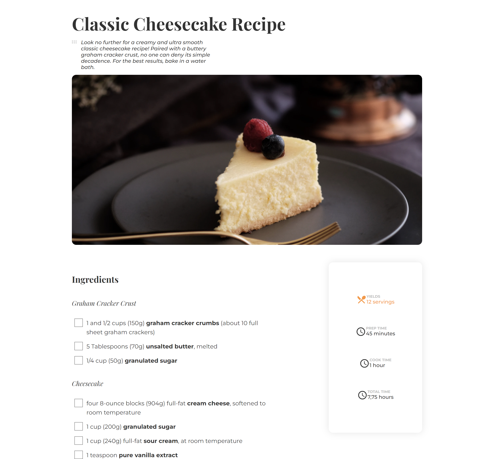

<!-- Please update value in the {}  -->

<h1 align="center">Recipe page</h1>

<div align="center">
   Solution for a challenge from  <a href="http://devchallenges.io" target="_blank">Devchallenges.io</a>.
</div>

<div align="center">
  <h3>
    <a href="https://gallant-heyrovsky-d401f6.netlify.app/">
      Demo
    </a>
    <span> | </span>
    <a href="https://github.com/Karobwe/devchallenge-recipe-page">
      Solution
    </a>
    <span> | </span>
    <a href="https://devchallenges.io/challenges/OEKdUZ6xs0h99C38XVht">
      Challenge
    </a>
  </h3>
</div>

<!-- TABLE OF CONTENTS -->

## Table of Contents

- [Overview](#overview)
  - [Built With](#built-with)
- [Features](#features)
- [How to use](#how-to-use)
- [Contact](#contact)
- [Acknowledgements](#acknowledgements)

<!-- OVERVIEW -->

## Overview



Checkout the [live demo] stored on Netlify !

I tried starting using BEM syntax. I still have to improve how to name classe, especially the block part.

### Built With

<!-- This section should list any major frameworks that you built your project using. Here are a few examples.-->

- [Webpack Encore](https://symfony.com/doc/current/frontend.html)
- [SASS](https://sass-lang.com/)

## Features

<!-- List the features of your application or follow the template. Don't share the figma file here :) -->

This application/site was created as a submission to a [DevChallenges](https://devchallenges.io/challenges) challenge. The [challenge](https://devchallenges.io/challenges/TtUjDt19eIHxNQ4n5jps) was to build an application to complete the following user stories:

- [x] User story: I can see a recipe with ingredients and instructions
- [x] User story: I can select a checkbox if I have the ingredients
- [x] User story: I can see the number of servings, baking times

## How To Use

To clone and run this application, you'll need [Git](https://git-scm.com) and [Node.js](https://nodejs.org/en/download/) (which comes with [npm](http://npmjs.com)) installed on your computer. From your command line:

```bash
# Clone this repository
$ git clone https://github.com/your-user-name/your-project-name

# Install dependencies
$ npm install

# Run the app
$ npm start
```

## Acknowledgements

<!-- This section should list any articles or add-ons/plugins that helps you to complete the project. This is optional but it will help you in the future. For exmpale -->

- [A Complete Guide to Flexbox](https://css-tricks.com/snippets/css/a-guide-to-flexbox/)
- [A Complete Guide to Grid](https://css-tricks.com/snippets/css/complete-guide-grid/)
- [How To Create a Custom Checkbox](https://www.w3schools.com/howto/howto_css_custom_checkbox.asp)
- [First-child full-width in Flexbox](https://stackoverflow.com/questions/41789278/first-child-full-width-in-flexbox)
- [BEM 101](https://css-tricks.com/bem-101/)

## Contact

- Website [karobwe.dev](https://karobwe.dev)
- GitHub [@Karobwe](https://github.com/Karobwe)
- Twitter [@Karobwe](https://twitter.com/Karobwe)
